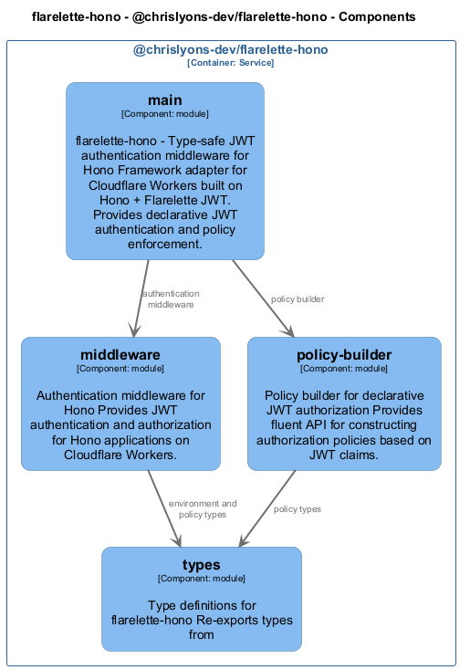

# @chrislyons-dev/flarelette-hono

[← Back to System Overview](./README.md)

---

## Container Context

---

## Container Information

<table>
<tbody>
<tr>
<td><strong>Name</strong></td>
<td>@chrislyons-dev/flarelette-hono</td>
</tr>
<tr>
<td><strong>Type</strong></td>
<td><code>Service</code></td>
</tr>
<tr>
<td><strong>Description</strong></td>
<td>Type-safe JWT authentication middleware for Hono on Cloudflare Workers</td>
</tr>
<tr>
<td><strong>Tags</strong></td>
<td><code>Auto-generated</code></td>
</tr>
</tbody>
</table>

---

## Components

### Component View

### Component Details

<table>
<thead>
<tr>
<th>Component</th>
<th>Type</th>
<th>Description</th>
<th>Code</th>
</tr>
</thead>
<tbody>
<tr>
<td><strong>main</strong></td>
<td><code>module</code></td>
<td>flarelette-hono - Type-safe JWT authentication middleware for Hono

Framework adapter for Cloudflare Workers built on Hono + Flarelette JWT.
Provides declarative JWT authentication and policy enforcement.</td>
<td><a href="./chrislyons_dev_flarelette_hono__main.md">View →</a></td>
</tr>
<tr>
<td><strong>middleware</strong></td>
<td><code>module</code></td>
<td>Authentication middleware for Hono

Provides JWT authentication and authorization for Hono applications on Cloudflare Workers.</td>
<td><a href="./chrislyons_dev_flarelette_hono__middleware.md">View →</a></td>
</tr>
<tr>
<td><strong>policy-builder</strong></td>
<td><code>module</code></td>
<td>Policy builder for declarative JWT authorization

Provides fluent API for constructing authorization policies based on JWT claims.</td>
<td><a href="./chrislyons_dev_flarelette_hono__policy_builder.md">View →</a></td>
</tr>
<tr>
<td><strong>types</strong></td>
<td><code>module</code></td>
<td>Type definitions for flarelette-hono

Re-exports types from</td>
<td><a href="./chrislyons_dev_flarelette_hono__types.md">View →</a></td>
</tr>
</tbody>
</table>

---

<a href="./README.md">← Back to System Overview</a> | Generated with <a href="https://github.com/chrislyons-dev/archlette">Archlette</a>

