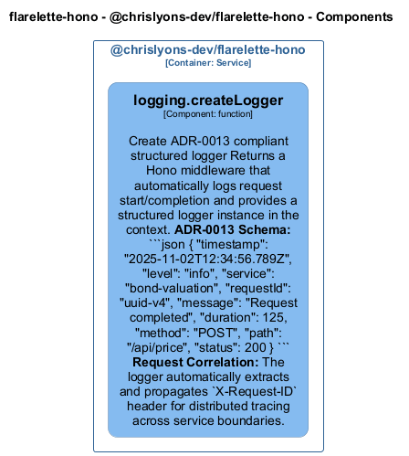

# logging — Code View

[← Back to Container](./chrislyons_dev_flarelette_hono.md) | [← Back to System](./README.md)

---

## Component Information

<table>
<tbody>
<tr>
<td><strong>Component</strong></td>
<td>logging</td>
</tr>
<tr>
<td><strong>Container</strong></td>
<td>@chrislyons-dev/flarelette-hono</td>
</tr>
<tr>
<td><strong>Type</strong></td>
<td><code>module</code></td>
</tr>
<tr>
<td><strong>Description</strong></td>
<td>Structured logging for Hono applications

Provides ADR-0013 compliant structured logging using hono-pino.
This is a thin wrapper that configures pino with the correct schema
for polyglot microservice consistency.</td>
</tr>
</tbody>
</table>

---

## Code Structure

### Class Diagram



### Code Elements

<details>
<summary><strong>1 code element(s)</strong></summary>


#### Functions

##### `createLogger()`

Create ADR-0013 compliant structured logger

Returns a Hono middleware that automatically logs request start/completion
and provides a structured logger instance in the context.

**ADR-0013 Schema:**
```json
{
  "timestamp": "2025-11-02T12:34:56.789Z",
  "level": "info",
  "service": "bond-valuation",
  "requestId": "uuid-v4",
  "message": "Request completed",
  "duration": 125,
  "method": "POST",
  "path": "/api/price",
  "status": 200
}
```

**Request Correlation:**
The logger automatically extracts and propagates `X-Request-ID` header
for distributed tracing across service boundaries.

<table>
<tbody>
<tr>
<td><strong>Type</strong></td>
<td><code>function</code></td>
</tr>
<tr>
<td><strong>Visibility</strong></td>
<td><code>public</code></td>
</tr>
<tr>
<td><strong>Returns</strong></td>
<td><code>MiddlewareHandler</code> — Hono middleware for structured logging</td>
</tr>
<tr>
<td><strong>Location</strong></td>
<td><code>C:/Users/chris/git/flarelette-hono/src/logging.ts:106</code></td>
</tr>
</tbody>
</table>

**Parameters:**

- `options`: <code>import("C:/Users/chris/git/flarelette-hono/src/logging").LoggerOptions</code> — - Logger configuration
**Examples:**
```typescript

```
```typescript

```

---

</details>

---

<div align="center">
<sub><a href="./chrislyons_dev_flarelette_hono.md">← Back to Container</a> | <a href="./README.md">← Back to System</a> | Generated with <a href="https://github.com/chrislyons-dev/archlette">Archlette</a></sub>
</div>
