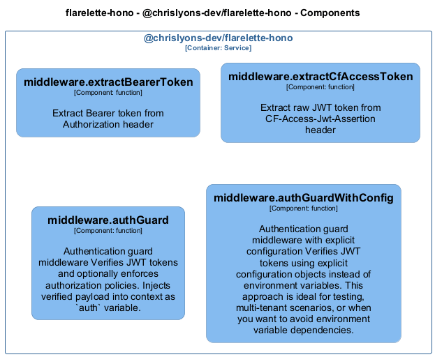

# middleware — Code View

[← Back to Container](./chrislyons_dev_flarelette_hono.md) | [← Back to System](./README.md)

---

## Component Information

<table>
<tbody>
<tr>
<td><strong>Component</strong></td>
<td>middleware</td>
</tr>
<tr>
<td><strong>Container</strong></td>
<td>@chrislyons-dev/flarelette-hono</td>
</tr>
<tr>
<td><strong>Type</strong></td>
<td><code>module</code></td>
</tr>
<tr>
<td><strong>Description</strong></td>
<td>Authentication middleware for Hono

Provides JWT authentication and authorization for Hono applications on Cloudflare Workers.</td>
</tr>
</tbody>
</table>

---

## Code Structure

### Class Diagram



### Code Elements

<details>
<summary><strong>2 code element(s)</strong></summary>


#### Functions

##### `extractBearerToken()`

Extract Bearer token from Authorization header

<table>
<tbody>
<tr>
<td><strong>Type</strong></td>
<td><code>function</code></td>
</tr>
<tr>
<td><strong>Visibility</strong></td>
<td><code>private</code></td>
</tr>
<tr>
<td><strong>Returns</strong></td>
<td><code>string</code> — Token string if valid Bearer token, null otherwise</td>
</tr>
<tr>
<td><strong>Location</strong></td>
<td><code>C:/Users/chris/git/flarelette-hono/src/middleware.ts:21</code></td>
</tr>
</tbody>
</table>

**Parameters:**

- `authHeader`: <code>string</code> — - Authorization header value

---
##### `authGuard()`

Authentication guard middleware

Verifies JWT tokens and optionally enforces authorization policies.
Injects verified payload into context as `auth` variable.

<table>
<tbody>
<tr>
<td><strong>Type</strong></td>
<td><code>function</code></td>
</tr>
<tr>
<td><strong>Visibility</strong></td>
<td><code>public</code></td>
</tr>
<tr>
<td><strong>Returns</strong></td>
<td><code>MiddlewareHandler<import("C:/Users/chris/git/flarelette-hono/src/types").HonoEnv></code> — Hono middleware handler</td>
</tr>
<tr>
<td><strong>Location</strong></td>
<td><code>C:/Users/chris/git/flarelette-hono/src/middleware.ts:64</code></td>
</tr>
</tbody>
</table>

**Parameters:**

- `policy`: <code>import("C:/Users/chris/git/flarelette-hono/src/types").Policy</code> — - Optional policy to enforce after authentication
**Examples:**
```typescript

```

---

</details>

---

<div align="center">
<sub><a href="./chrislyons_dev_flarelette_hono.md">← Back to Container</a> | <a href="./README.md">← Back to System</a> | Generated with <a href="https://github.com/chrislyons-dev/archlette">Archlette</a></sub>
</div>
