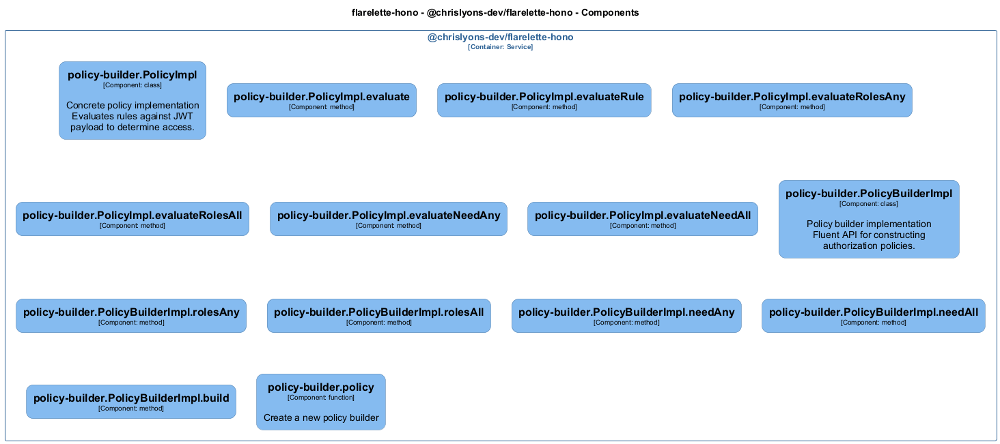

# policy-builder — Code View

[← Back to Container](./chrislyons_dev_flarelette_hono.md) | [← Back to System](./README.md)

---

## Component Information

<table>
<tbody>
<tr>
<td><strong>Component</strong></td>
<td>policy-builder</td>
</tr>
<tr>
<td><strong>Container</strong></td>
<td>@chrislyons-dev/flarelette-hono</td>
</tr>
<tr>
<td><strong>Type</strong></td>
<td><code>module</code></td>
</tr>
<tr>
<td><strong>Description</strong></td>
<td>Policy builder for declarative JWT authorization

Provides fluent API for constructing authorization policies based on JWT claims.</td>
</tr>
</tbody>
</table>

---

## Code Structure

### Class Diagram



### Code Elements

<details>
<summary><strong>14 code element(s)</strong></summary>


#### Classes

##### `PolicyImpl`

Concrete policy implementation

Evaluates rules against JWT payload to determine access.

<table>
<tbody>
<tr>
<td><strong>Type</strong></td>
<td><code>class</code></td>
</tr>
<tr>
<td><strong>Visibility</strong></td>
<td><code>private</code></td>
</tr>
<tr>
<td><strong>Location</strong></td>
<td><code>C:/Users/chris/git/flarelette-hono/src/policy.ts:26</code></td>
</tr>
<tr>
<td><strong>Implements</strong></td>
<td><code>Policy</code></td>
</tr>
</tbody>
</table>


---
##### `PolicyBuilderImpl`

Policy builder implementation

Fluent API for constructing authorization policies.

<table>
<tbody>
<tr>
<td><strong>Type</strong></td>
<td><code>class</code></td>
</tr>
<tr>
<td><strong>Visibility</strong></td>
<td><code>private</code></td>
</tr>
<tr>
<td><strong>Location</strong></td>
<td><code>C:/Users/chris/git/flarelette-hono/src/policy.ts:145</code></td>
</tr>
<tr>
<td><strong>Implements</strong></td>
<td><code>PolicyBuilder</code></td>
</tr>
</tbody>
</table>


---

#### Functions

##### `policy()`

Create a new policy builder

<table>
<tbody>
<tr>
<td><strong>Type</strong></td>
<td><code>function</code></td>
</tr>
<tr>
<td><strong>Visibility</strong></td>
<td><code>public</code></td>
</tr>
<tr>
<td><strong>Returns</strong></td>
<td><code>import("C:/Users/chris/git/flarelette-hono/src/types").PolicyBuilder</code> — PolicyBuilder instance for fluent API construction</td>
</tr>
<tr>
<td><strong>Location</strong></td>
<td><code>C:/Users/chris/git/flarelette-hono/src/policy.ts:199</code></td>
</tr>
</tbody>
</table>


**Examples:**
```typescript

```

---

</details>

---

<div align="center">
<sub><a href="./chrislyons_dev_flarelette_hono.md">← Back to Container</a> | <a href="./README.md">← Back to System</a> | Generated with <a href="https://github.com/chrislyons-dev/archlette">Archlette</a></sub>
</div>
